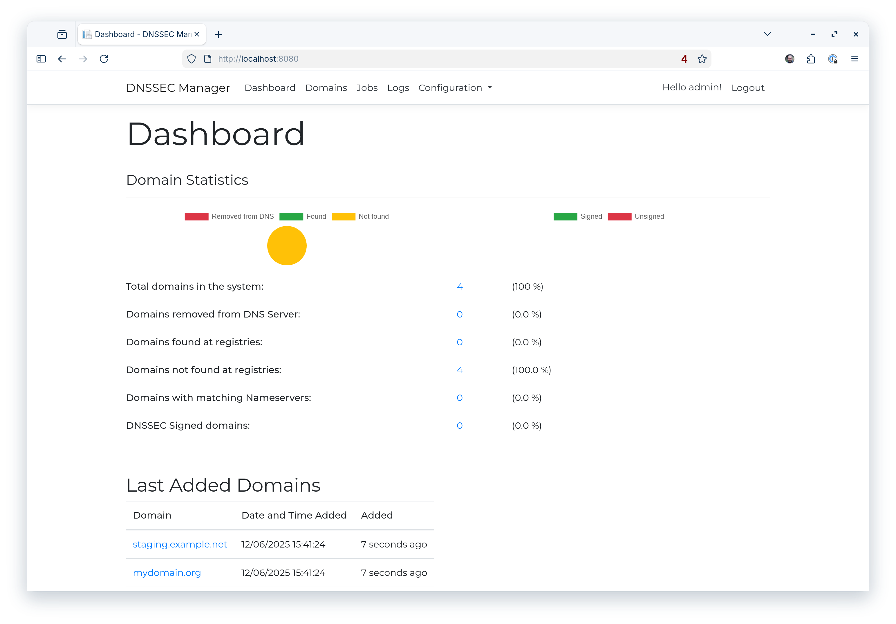

# DNSSEC Manager for PowerDNS


**DNSSEC Manager** is a tool for DNS administrators that connects your PowerDNS nameservers with your domain registrars. It automates the signing of DNS zones with DNSSEC and uploads the signing keys to the domain registrars.

## How it works

The application connects to your **PowerDNS Authoritative Nameserver** via its API and to your **domain registrars** via their API. It checks whether a domain can be signed with DNSSEC to provide enhanced security, and handles the signing and key uploads automatically.

## Supported Registries

Currently we support the following registries:
- SIDN (.nl)
- Openprovider
- TransIP

We will be adding more registries in the future and you can contribute your own implementations in the folder: /Providers/Providers

## 🖼 UI Preview

### 📊 Dashboard


Real-time DNSSEC system status and domain statistics.

## 🚀 Deployment Options

### 1️⃣ One-command installer (Ubuntu 24.04 VPS)

Tested on a clean Ubuntu 24.04 VPS server, this script installs a complete DNS server:

- PowerDNS Authoritative
- MariaDB
- DNSSEC Manager backend
- Traefik

The wizard will tell you which DNS records you need to create to get started with your own PowerDNS nameserver.

```bash
curl -sSL https://dnssecmanager.net/install.sh | bash
```

### 2️⃣ Standalone Docker container (DNSSEC Manager only)

Already have your own PowerDNS Auth server infra running? Spin up the DNSSEC Manager and connect it.

```bash
docker pull ghcr.io/dnssec-manager/dnssec-manager:latest
docker run -d -p 8080:8080 \
  -v dnssecmanager-storage:/app/storage \
  ghcr.io/dnssec-manager/dnssec-manager:latest
```

#### Prepare PowerDNS

To use this option, you need a running **PowerDNS Authoritative Nameserver**: [PowerDNS Authoritative Guide](https://doc.powerdns.com/authoritative/)

- Configure API access in `/etc/pdns/pdns.conf`
- Ensure your firewall allows access
- For SSL configuration: [Configuring SSL for PowerDNS API](https://www.paulhermans.eu/configuring-ssl-for-powerdns-api/)


### 3️⃣ Git Clone and Docker Compose

Get the DNSSEC Manager running in just a few steps:

```bash
git clone https://github.com/DNSSEC-Manager/DNSSEC-Manager.git
cd DNSSEC-Manager
docker compose up -d
```

Open the web interfaces:
- PowerDNS statistics
http://localhost:8081/
- DNSSEC Manager
http://localhost:8080/

#### What Docker Compose Spins Up 🐳

When you run `docker compose up -d`, three containers are started automatically:

| Container | Purpose                                     | Emoji |
|-----------|---------------------------------------------|-------|
| `backend` | The **DNSSEC Manager** web application      | 🖥️   |
| `pdns`    | **PowerDNS Authoritative Nameserver**       | 🌐   |
| `db`      | **MariaDB for PowerDNS database storage** | 💾  |

This setup ensures your DNSSEC Manager can communicate with PowerDNS and store data automatically, without any extra configuration.

## Default login

- **Username:** admin
- **Password:** ChangeMe123!
- **Email:** example@dnssecmanager.net

> Change the default credentials immediately after first login.

## First-time setup

1. Log in to the application (see default login above).
2. Click **"Hello admin!"** to change the password and enable **Two-Factor Authentication**.
3. Configure the application:
    - Add your **DNS server** (connect to PowerDNS API)
    - Add **Nameserver Groups** corresponding to your DNS server
    - Add your **Domain Registries** (connect to registry API)
    - Add **TLDs** corresponding with your registry (if needed)

> **Note:** If you cannot connect to your registry, you may need to whitelist your web server to access the API.

## Credits

- Paul Hermans
- Dylan Bos (Internship 2019)

## License

This project is released under the **MIT License**. For details, see the [LICENSE](LICENSE) file.
